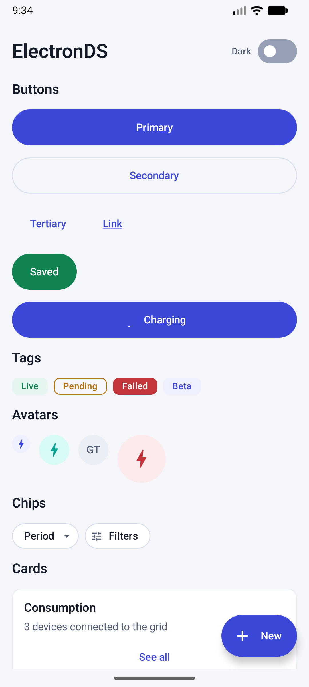
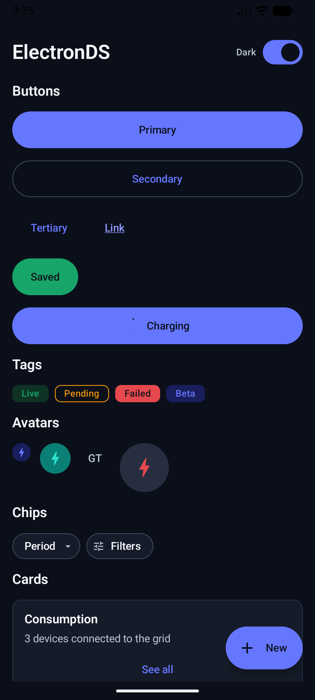
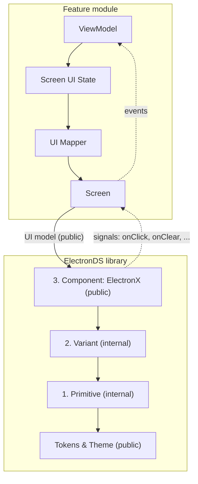

# ElectronDS

[](https://medium.com/@gabriel_theCode/building-a-scalable-ui-system-in-jetpack-compose-7017c5977b63)

A production-grade Jetpack Compose design system built on a **3-layered UI architecture** (Primitive, Variant, Component). ElectronDS is designed for precision software: fintech dashboards, developer tooling, energy and telemetry products.

This project serves as the technical companion to the article [Building a Scalable UI System in Jetpack Compose](https://medium.com/@gabriel_theCode/building-a-scalable-ui-system-in-jetpack-compose-7017c5977b63).

## Preview

| Light Mode | Dark Mode |
|:---:|:---:|
|  |  |

## The 3-Layer Architecture

ElectronDS enforces strict boundaries between layers to ensure scalability and maintainability.



The feature module owns the ViewModel, screen state, mappers and screens. The
library exposes only Components, their UI models and the tokens/theme;
variants and primitives stay `internal`.

### 1. Primitive (`internal`)
Stateless visual blocks. They receive raw, fully resolved parameters (Color, Dp, TextStyle). They have no "meaning"—only rendering.

### 2. Variant (`internal`)
The bridge between semantics and raw values. Variants receive a component-specific UI model and resolve semantic tokens (e.g., `TagTone.Success`) into the correct colors and shapes for the current theme.

### 3. Component (`public`)
The single public entry point. It dispatches on a sealed UI model class and exposes signals upward, one callback per interaction (`onClick`, `onClear`, ...). By using `explicitApi()`, we ensure that only the intended Component layer is accessible to feature teams.

---

## Core Principles

- **Visually Authoritative, Behaviorally Neutral**: The system owns *how* it looks; the feature owns *what* it means and *how* it behaves.
- **Sealed UI Models**: Components are driven by immutable, sealed data classes. This eliminates "parameter bloat" and makes testing easier.
- **Upward Signals**: User interactions are emitted upward as signals, each through its own dedicated callback (e.g., `onClick`, `onClear`, `onCloseClick`).
- **Strict Enforcement**: Uses Kotlin's `internal` visibility and `explicitApi()` mode to prevent leaking implementation details.

---

## Components

| Category | Components |
|---|---|
| Actions | `ElectronButton`, `ElectronFab`, `ElectronChip` |
| Inputs & selection | `ElectronInputField`, `ElectronSwitch`, `ElectronCheckbox`, `ElectronRadioButton`, `ElectronSegmentedControl` |
| Display | `ElectronIcon`, `ElectronAvatar`, `ElectronTag`, `ElectronBadge`, `ElectronDivider`, `ElectronProgressIndicator` |
| Containers | `ElectronCard`, `ElectronSheetHeader`, `ElectronScaffold` |
| Composites | `ElectronListItem`, `ElectronMetricCard`, `ElectronTopBar`, `ElectronEmptyState`, `ElectronDialog` |

Composites are built only from other public Electron components, following the same 3-layer rules.

---

## Design System Tokens

ElectronDS uses a "Charged Instrument Panel" identity—cool graphite surfaces with electric primary accents.

- **Color**: Semantic roles (e.g., `content.primary`, `status.success`) instead of raw hex codes.
- **Typography**: Precision-focused. Includes a specialized `data` family (JetBrains Mono) for aligned numeric displays.
- **Shape**: Crisp 8dp/12dp silhouettes defined in `ElectronShapes`.
- **Spacing**: A strict 4dp grid (2dp to 64dp).

---

## Project Structure

| Module | Purpose |
|---|---|
| `:electronds` | The core library. Contains tokens, theme, and components. |
| `:app` | The Component Catalog. Demonstrates real-world usage of the system. |

---

## Quick Start

### Basic Usage
```kotlin
ElectronTheme {
    ElectronButton(
        uiModel = ButtonUiModel.Primary(text = "Confirm Transfer", isFullWidth = true),
        onClick = { /* Handle click */ }
    )
}
```

### Multiple Interactions
```kotlin
ElectronChip(
    uiModel = ChipUiModel.Filter(
        defaultText = "Period",
        valueText = "30 days",
        isSelected = true
    ),
    onClick = { /* Handle selection */ },
    onClear = { /* Handle removal */ }
)
```

## Documentation

- [Architecture Deep Dive](docs/ARCHITECTURE.md) - The rules of the 3-layer system.
- [Design Decisions](docs/DESIGN_DECISIONS.md) - Rationale behind colors, type, and motion.
- [Usage Guidelines](docs/USAGE_GUIDELINES.md) - Best practices for feature teams.

---

## License

This project is licensed under the MIT License - see the [LICENSE](LICENSE) file for details.
